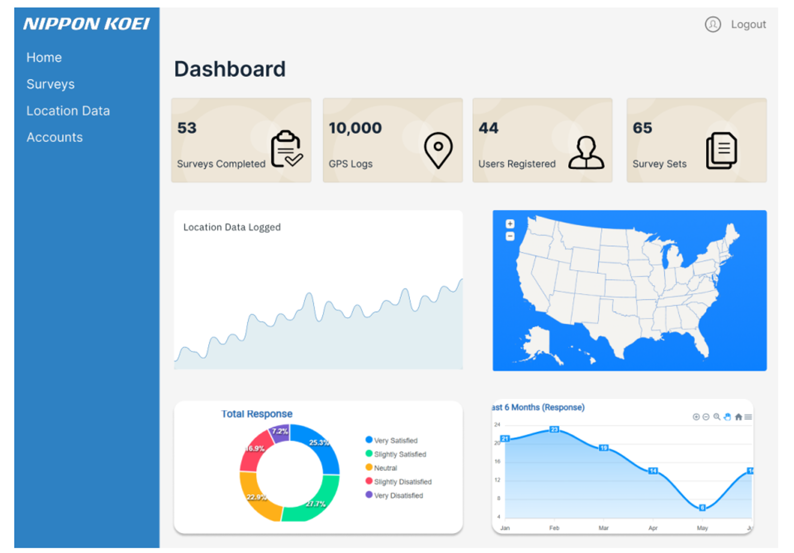
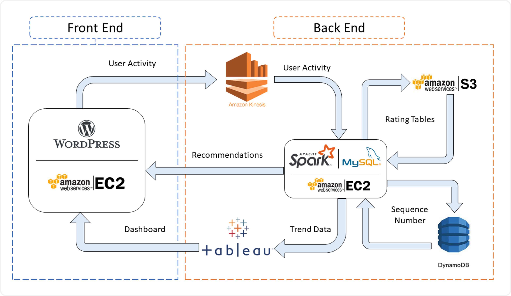

## Profile
A Computing Science graduate with Honours, equipped with a robust programming foundation. I possess diverse experience in project management, research, and process improvement, exhibiting flexibility and adaptability across various roles. Adept at supporting IT projects, conducting research analysis, and collaborating effectively with teams. Eager to leverage my technical expertise and project support acumen in IT management or consultancy, bridging business objectives and technological solutions.

*For PDF resume format, download [here](./assets/files/KohDingYuan_Resume.pdf).*

---

## Education
**BSc (Hons) Computing Science** | October 2024  
  Singapore Institute of Technology & University of Glasgow  
  *Specialized in Internet of Things (IOT)*
  
**Diploma in Information Technology** | May 2019  
  Singapore Polytechnic  
  *Specialized in Solution Development*

---

## Experience

*For more detailed feedback, download my testimonials [here](./assets/files/KohDingYuan_Testimonials.pdf).*

- **Store Incharge [National Service]** | December 2019 – August 2021  
  *Republic of Singapore Air Force, Singapore*

  As a member of the infrastructure team, managed external contractors to ensure smooth project execution and adherence to timelines. Additionally, supported the unit's procurement processes by raising purchase requisitions and assisting in finance audit processes as a member of the finance team. Contributed to the efficient operations and resource management of multiple logistical aspects.
  

   
Achievements

   <strong>Budget Planning</strong>
   <ul>
	   <li>Assisted in annual budget planning by analyzing three years of expense data for higher accuracy forecasting of FY21/22 budget.</li>
	   <li>Leveraged historical data and quarter-on-quarter analaysis to forecast budgets amid the COVID-19 transition.</li>
	   <li>Utilized manual analysis methods like linear regression and moving averages to identify trends.</li>
	   <li>Further enhanced forecasting accuracy by breaking down expenses into subcategories and analyzing independently.</li>
   </ul>

   <strong>Infrastructural Improvements</strong>
   <ul>
       <li>Facilitated contractor work by preparing clearance forms, streamlining workflows, and adhering to regulations.</li>
       <li>Oversaw contractors and tracked projects to ensure seamless execution of major infrastructure work, including anti-slip tile installation, upgrading to energy-efficient LEDs, and comprehensive toilet renovations.</li>
       <li>Coordinated routine contractor services like tank inspections and pest control, ensuring compliance with standards and schedules.</li>
   </ul>

   <strong>National Day Parade 2020</strong>
   <ul>
       <li>Part of the team that managed the dispatch of buses to transport parade participants.</li>
       <li>Identified communication gaps and logistics coordination inefficiencies during the event.</li>
       <li>Developed a Telegram chatbot to streamline on-site communication and provide real-time access to relevant data sources, improving information availability.</li>
       <li>Improved the efficiency and accuracy of logistics, ensuring a smoother event and setting a new standard for communication in large-scale events.</li>
   </ul>

 

- **Software Development Intern** | April 2018 – August 2018  
  *KEYfields Pte Ltd, Singapore*

  Contributed to the research and development of features for the company's primary web-based solution by writing and optimizing code using C#, ASP.NET, and MS SQL. My focus was on developing modular, scalable functions that enhanced the platform's functionality and overall value.

   
Achievements

   <strong>Route Optimization Algorithm</strong>
   <ul>
	<li>Developed a route optimization algorithm that leveraged Dijkstra's Algorithm and the Google Maps API's live data to address a critical client need and enhance the company's offerings.</li>
	   <li>The algorithm incorporated route planning and optimization features to solve the Travelling Salesman problem.</li>
	   <li>The solution helped retain a client who had considered switching to a competitor due to lacking such features, contributing to the client's satisfaction and their continued business.</li>
   </ul>

   <strong>National Trade Platform (NTP)</strong>
   <ul>
	   <li>Developed API functions and data transformation processes with Singapore Customs and Accenture to integrate the company's solution with the National Trade Platform.</li>
	   <li>Integration ensured the solution met regulations, enabling clients to access government services and comply.</li>
	   <li>The NTP integration enhanced the company's competitiveness by providing government-compliant services, increasing the solution's value and utilization among clients seeking such services.</li>
   </ul>

   <strong>Brute Force Attack Detection</strong>
   <ul>
	   <li>Discovered a significant performance drop in the company's SQL server and investigated the database logs, finding unusual activity from an IP in a country with no registered clients.</li>
	   <li>Traced anomaly prompted detection of a potential brute force attack and promptly reported findings to the supervisor.</li>
	   <li>Provided recommendations to enhance database security, with actions taken to improve protection against attacks and safeguarding data.</li>
   </ul>

   <strong>Backup Checker</strong>
   <ul>
	   <li>Developed a console app to automate backup file monitoring and anomaly detection, streamlining the process by identifying discrepancies and enhancing efficiency while mitigating data integrity risks.</li>
   </ul>

   <strong>Memory Leak Identification</strong>
   <ul>
	   <li>Client's server performance issue was initially misdiagnosed as a memory shortage, leading them to acquire additional RAM, but the problem persisted.</li>
	   <li>Brought in to provide a different perspective on the issue.</li>
	   <li>Hypothesized memory leak, not lack of memory, and identified multiple unclosed database connections due to poor coding - validated hypothesis and resolved issue.</li>
   </ul>

 

---

## Notable Projects

**Mobile Application Development for Reward Pedagogy Research | 2024**  
  *BSc Computing Science Undergraduate | Singapore Institute of Technology*  

  
Project Details

  <strong>Client</strong>: Prof. Peter C Y Yau (University of Glasgow)

  

  
Developed a comprehensive full-stack mobile application independently to support reward-based systems in education, aimed at boosting student motivation and engagement. The solution features dedicated portals for teachers, parents, and students, enabling task and reward management using stars, hearts, and diamonds. Parents can assign tasks and rewards, while children track progress and redeem rewards, fostering an engaging and interactive learning environment.
  Built using React Native or Flutter, the app provides a seamless user experience, supported by a robust and scalable backend, showcasing the versatility and technical expertise applied in every aspect of the project.

  

	
Technical Details

  <h3>Tech Stack</h3>
	<ul>
	  <li><strong>Front End (Android Mobile)</strong>: Flutter, Dart, Material UI</li>
	  <li><strong>Back End (API Server)</strong>: Django, Python</li>
	  <li><strong>Database</strong>: MySQL</li>
	</ul>

  <h3>Solution Architecture</h3>
	
	

    

   
The architecture uses a REST API for clear separation of concerns and modularity, essential for scalable and maintainable application development. The mobile app frontend is created with Flutter, while the backend API server is built using Django. This design enables independent operation of the frontend and backend, making updates and maintenance easier. Django functions solely as an API server handling requests and responses.
   
   This improves the system's effectiveness by offloading data processing and business logic to the backend. The backend server interacts with a MySQL database, serving as the centralized data storage for the application. Using RESTful APIs ensures that communication between the frontend and backend is stateless, standardized, and easily scalable, enabling seamless handling of high loads and multiple client requests.
   
   This architectural design supports flexibility by allowing independent development and scaling of the frontend while maintaining consistent and efficient communication through RESTful APIs.

  

 

**Activity Survey Application for Smart City Planning | 2022 - 2023**  
  *BSc Computing Science Undergraduate | Singapore Institute of Technology*  

  
Project Details

  <strong>Client</strong>: Nippon Koei Co., Ltd.

   
   

  
For this project, I was responsible for the technical leadership of a 10-person team in the development of a cross-platform mobile application intended to simplify the travel survey process, aligned with the requirements specified by our client, Nippon Koei Co., Ltd. The mobile application was designed to collect GPS and Bluetooth connection logs, facilitating more convenient data sharing by respondents through a web-based questionnaire. By replacing the traditional door-to-door survey method, our solution enables more accurate and efficient data collection.
  
  I also oversaw the integration of a web-based dashboard that allows administrators to manage surveys, accounts, and conduct data analysis. This dashboard interfaces with the mobile application via a Web API and supports cloud-based data storage. The project's ultimate objective was to streamline the travel survey process, enhance the user experience, and contribute valuable data to support urban redevelopment and transportation improvement initiatives.

 

	
Technical Details

  <h3>Tech Stack</h3>
	<ul>
	  <li><strong>Front End (Mobile)</strong>: React Native, Node.js</li>
	  <li><strong>Front End (Dashboard)</strong>: React.js, Node.js</li>
	  <li><strong>Back End (API Server)</strong>: C#, ASP.Net</li>
	  <li><strong>Database</strong>: MS SQL</li>
	</ul>

  <h3>Solution Architecture</h3>
	

    

   
The solution architecture integrates a mobile application, a web-based dashboard, and a backend database to streamline the travel survey process. The mobile app enables users to track travel data via GPS, complete dynamically generated surveys, and store local data temporarily for offline access. It also includes features like reward points redemption to incentivize participation. The web dashboard provides staff with tools for data analysis, survey and account management, and a geographical information display. It serves as the interface between the mobile app and the backend, hosting APIs for seamless data transmission. The backend database, hosted on AWS using Amazon RDS and Microsoft SQL Server, securely stores and organizes collected user data, ensuring administrators can maintain and manage the system effectively.

  

 

**Streaming Analytics for E-Commerce Website | 2018 - 2019**  
  *Diploma Undergraduate | Singapore Polytechnic*  

  
Project Details

  <strong>Client</strong>: Singapore Polytechnic

   

   <h3>Tech Stack</h3>
	<ul>
	  <li>Scala, MySQL, Wordpress</li>
	</ul>
	
  
Development of a real-time machine learning algorithm tailored for streaming analytics in an e-commerce context. The project focused on capturing live user inputs from the website to train a recommendation model using the Alternating Least Squares (ALS) method. This approach enabled the system to dynamically identify and suggest relevant products to users based on their behavior and preferences. My primary responsibility was writing the code for the machine learning algorithm, ensuring its efficiency and seamless integration into the live environment.

 

---

## Skills
- **Communication Skills** 
  *Strong written and verbal communication abilities demonstrated through technical documentation, training staff, vendor management, and regular updates to stakeholders.*
    
- **Teamwork & Collaboration** 
  *Worked effectively with cross-functional teams to achieve project goals, contributing to collective efforts in research and development tasks.*
    
- **Adaptability** 
  *Adjusted to different roles and industries, thriving in diverse environments such as software development, project management, and research analysis.*
    
- **Problem-Solving** 
  *Utilized analytical thinking to identify and resolve issues, optimizing existing processes and generating extra value.*
    
- **Time Management & Organization** 
  *Managed multiple projects and deadlines simultaneously, ensuring tasks were completed on time while maintaining high-quality results.*
    
- **Leadership & Initiative** 
  *Took leadership in managing tasks, such as overseeing coding teams and setting up SOPs, demonstrating initiative and responsibility in various roles.*
    
- **Analytical Thinking** 
  *Applied analytical skills to data-driven tasks, such as conducting quantitative research and performing financial analysis, to support informed decision-making.*
    

---

## Technical Skills
- **Solution Development**  
  Android Mobile App Development
  Full Stack (Web & API) Development
  IoT Solution Development & Design 
    
- **Programming Languages** 
  Assembly Language
  C
  C#
  Dart
  Java
  JavaScript
  Kotlin
  Python
  Scala
  SQL
  T-SQL
    
- **Markup Languages** 
  CSS
  HTML
  JSON
  Markdown
  XML
  XHTML
    
- **Frameworks & Libraries** 
  ASP.NET (MVC, Razor, Core)
  Bootstrap
  Django
  Flask
  Flutter
  jQuery
  Material UI
  Node.js
  React.js
  Vue.js
  Next.js
    
- **Databases** 
  MongoDB
  Microsoft SQL Server (MS SQL)
  MySQL
  SQLite
    
- **Cloud Computing** 
  Amazon Web Services (AWS)
  Google Cloud Platform (GCP)
  Microsoft Azure
    

---

## Languages
English
Chinese (Mandarin)