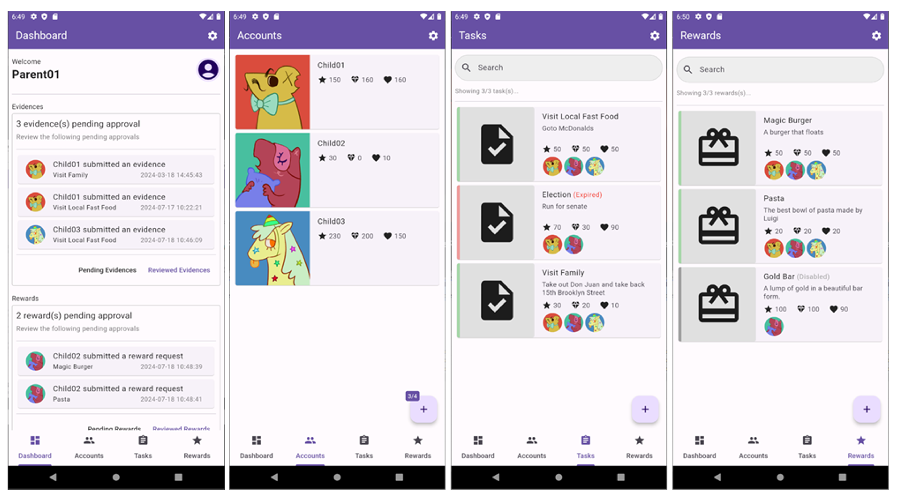

<head>
	<title>Koh DY Portfolio</title>
	<link href="https://cdn.jsdelivr.net/npm/bootstrap@5.3.0/dist/css/bootstrap.min.css" rel="stylesheet">
</head>

A Computing Science graduate with Honours, equipped with a robust programming foundation. I possess diverse experience in project management, research, and process improvement, exhibiting flexibility and adaptability across various roles. Adept at supporting IT projects, conducting research analysis, and collaborating effectively with teams. Eager to leverage my technical expertise and project support acumen in IT management or consultancy, bridging business objectives and technological solutions.

	<h1 class="text-center">My Portfolio</h1>
	
Welcome to my portfolio showcasing my skills and projects.

	<button class="btn btn-primary">Click Me</button>

*For PDF resume format, download [here](./assets/files/KohDingYuan_Resume.pdf).*

---

## Education
**BSc (Hons) Computing Science** | October 2024  
  Singapore Institute of Technology & University of Glasgow  
  *Specialized in Internet of Things (IOT)*
 
**Diploma in Information Technology** | May 2019  
  Singapore Polytechnic  
  *Specialized in Solution Development*

---

## Experience

*For more detailed feedback, download my testimonials [here](./assets/files/KohDingYuan_Testimonials.pdf).*

**IT Project Management Intern** | August 2023 – April 2024  
  *ASM International, Singapore*
- Assisted in managing complex IT projects and supported project management administrative processes.
- **Project Panaya**: Standardized internal processes, created documentation, provided technical support, and conducted training for staff for Panaya’s SAP Testing.
- **Project Variant Configurator (VC) Phase 2**: Supported System Integration Test, User Acceptance Test, and Go Live phases; facilitated onsite collaboration.
- **Project TRANS4M**: Assisted with administrative tasks and logistics.

**Research Assistant** | October 2021 – January 2023  
  *Singapore Institute of Technology, Singapore*
- Conducted quantitative research analysis, oversaw coding tasks for a team, and developed a data capture system in Excel.
- **Project Blended Design and Critical Thinking**: Contributed to a large-scale SIT ALIGN funded project, performed lesson observations, and conducted literature reviews.

**Store Incharge [National Service]** | December 2019 – August 2021  
  *Republic of Singapore Air Force, Singapore*
- Managed unit procurement finances and oversaw building operations; acted as a liaison with contractors.
- **Budget Planning**: Assisted in annual budget planning and analyzed three years of expense data for accuracy.
- **Infrastructural Improvements**: Supervised renovation projects and enhanced tracking with improved Excel sheets; built strong vendor relationships.
  
**Software Development Intern** | April 2018 – August 2018  
  *KEYfields Pte Ltd, Singapore*
- Conducted research and development activities using C#, ASP.NET, and MS SQL.
- **Route Optimization Algorithm**: Developed an algorithm for the Travelling Salesman problem using Google Maps API for live data.
- **National Trade Platform (NTP)**: Developed API functions and engineered data transformation processes in collaboration with Singapore Customs and Accenture.
- **Backup Checker**: Designed a console application for backup file monitoring and anomaly detection.
- **Brute Force Attack Detection**: Identified and reported SQL server attacks, providing recommendations for mitigation.

---

## Notable Projects

**Mobile Application Development for Reward Pedagogy Research | 2024**  
  *BSc Computing Science Undergraduate | Singapore Institute of Technology & University of Glasgow*  

  
Project Details

  <strong>Client</strong>: Prof. Peter C Y Yau (University of Glasgow)

  

  
This full stack project developed a mobile app to support reward-based systems in education, boosting student motivation and involvement. The solution lets teachers and parents handle tasks and rewards like stars, hearts, and diamonds, with dedicated portals for each. Parents can assign tasks and rewards, while kids can track progress and cash in rewards. The platform seeks to enhance learning experiences and promote more engaging educational approaches. Built using React Native or Flutter, the app delivers a smooth mobile experience with a scalable, robust backend.

  

    
Technical Details

  <h3>Tech Stack</h3>
    <ul>
      <li><strong>Front End (Android Mobile)</strong>: Flutter, Dart, Material UI</li>
      <li><strong>Back End (API Server)</strong>: Django, Python</li>
      <li><strong>Database</strong>: MySQL</li>
    </ul>

  <h3>Solution Architecture</h3>
    
    

    

   
The architecture uses a REST API for clear separation of concerns and modularity, essential for scalable and maintainable application development. The mobile app frontend is created with Flutter, while the backend API server is built using Django. This design enables independent operation of the frontend and backend, making updates and maintenance easier. Django functions solely as an API server handling requests and responses. This improves the system's effectiveness by offloading data processing and business logic to the backend. The backend server interacts with a MySQL database, serving as the centralized data storage for the application. Using RESTful APIs ensures that communication between the frontend and backend is stateless, standardized, and easily scalable, enabling seamless handling of high loads and multiple client requests. This architectural design supports flexibility by allowing independent development and scaling of the frontend while maintaining consistent and efficient communication through RESTful APIs.

  

 

**Activity Survey Application for Smart City Planning | 2022 - 2023**  
  *BSc Computing Science Undergraduate | Singapore Institute of Technology & University of Glasgow*  

  
Project Details

  <strong>Client</strong>: Nippon Koei Co., Ltd.

   
   

  
For this project, I was responsible for the technical leadership of a 10-person team in the development of a cross-platform mobile application intended to simplify the travel survey process, aligned with the requirements specified by our client, Nippon Koei Co., Ltd. The mobile application was designed to collect GPS and Bluetooth connection logs, facilitating more convenient data sharing by respondents through a web-based questionnaire. By replacing the traditional door-to-door survey method, our solution enables more accurate and efficient data collection. I also oversaw the integration of a web-based dashboard that allows administrators to manage surveys, accounts, and conduct data analysis. This dashboard interfaces with the mobile application via a Web API and supports cloud-based data storage. The project's ultimate objective was to streamline the travel survey process, enhance the user experience, and contribute valuable data to support urban redevelopment and transportation improvement initiatives.

 

    
Technical Details

  <h3>Tech Stack</h3>
    <ul>
      <li><strong>Front End (Mobile)</strong>: React Native, Node.js</li>
      <li><strong>Front End (Dashboard)</strong>: React.js, Node.js</li>
      <li><strong>Back End (API Server)</strong>: C#, ASP.Net</li>
      <li><strong>Database</strong>: MS SQL</li>
    </ul>

  <h3>Solution Architecture</h3>
    

    

   
The solution architecture integrates a mobile application, a web-based dashboard, and a backend database to streamline the travel survey process. The mobile app enables users to track travel data via GPS, complete dynamically generated surveys, and store local data temporarily for offline access. It also includes features like reward points redemption to incentivize participation. The web dashboard provides staff with tools for data analysis, survey and account management, and a geographical information display. It serves as the interface between the mobile app and the backend, hosting APIs for seamless data transmission. The backend database, hosted on AWS using Amazon RDS and Microsoft SQL Server, securely stores and organizes collected user data, ensuring administrators can maintain and manage the system effectively.

  

 

**Streaming Analytics for E-Commerce Website | 2018 - 2019**  
  *Diploma Undergraduate | Singapore Polytechnic*  

  
Project Details

  <strong>Client</strong>: Singapore Polytechnic

   

   <h3>Tech Stack</h3>
    <ul>
      <li>Scala, MySQL, Wordpress</li>
    </ul>
    
  
Development of a real-time machine learning algorithm tailored for streaming analytics in an e-commerce context. The project focused on capturing live user inputs from the website to train a recommendation model using the Alternating Least Squares (ALS) method. This approach enabled the system to dynamically identify and suggest relevant products to users based on their behavior and preferences. My primary responsibility was writing the code for the machine learning algorithm, ensuring its efficiency and seamless integration into the live environment.

 

---

## Skills

### Soft Skills
- **Communication Skills:**  
  *Strong written and verbal communication abilities demonstrated through technical documentation, training staff, vendor management, and regular updates to stakeholders.*
- **Teamwork & Collaboration:**  
  *Worked effectively with cross-functional teams to achieve project goals, contributing to collective efforts in research and development tasks.*
- **Adaptability:**  
  *Adjusted to different roles and industries, thriving in diverse environments such as software development, project management, and research analysis.*
- **Problem-Solving:**  
  *Utilized analytical thinking to identify and resolve issues, optimizing existing processes and generating extra value.*
- **Time Management & Organization:**  
  *Managed multiple projects and deadlines simultaneously, ensuring tasks were completed on time while maintaining high-quality results.*
- **Leadership & Initiative:**  
  *Took leadership in managing tasks, such as overseeing coding teams and setting up SOPs, demonstrating initiative and responsibility in various roles.*
- **Analytical Thinking:**  
  *Applied analytical skills to data-driven tasks, such as conducting quantitative research and performing financial analysis, to support informed decision-making.*

### Technical Skills
- **Solution Development**:  Android Mobile App Development, Full Stack (Web & API) Development, IoT Solution Development & Design  
- **Programming Languages**:  Assembly Language, C, C#, Dart, Java, JavaScript, Kotlin, Python, Scala, SQL
- **Markup Languages**:  CSS, HTML, JSON, Markdown, XML, XHTML
- **Frameworks & Libraries**:  ASP.NET (MVC, Razor, Core), Bootstrap, Django REST Framework, Flask, Flutter, jQuery, Material UI, Node.js, React.js, Vue.js  
- **Databases**:  MongoDB, Microsoft SQL Server, MySQL, SQLite
- **Cloud Computing**:  Amazon Web Services (AWS), Google Cloud Platform (GCP), Microsoft Azure

### Languages
English | Chinese (Mandarin)
