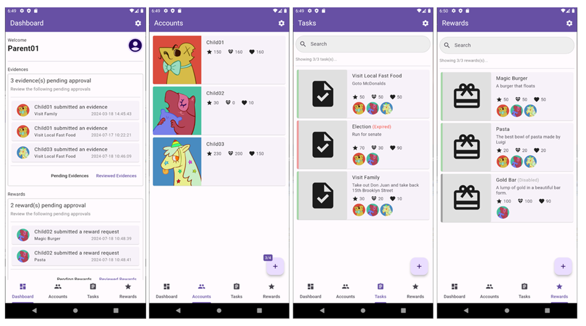
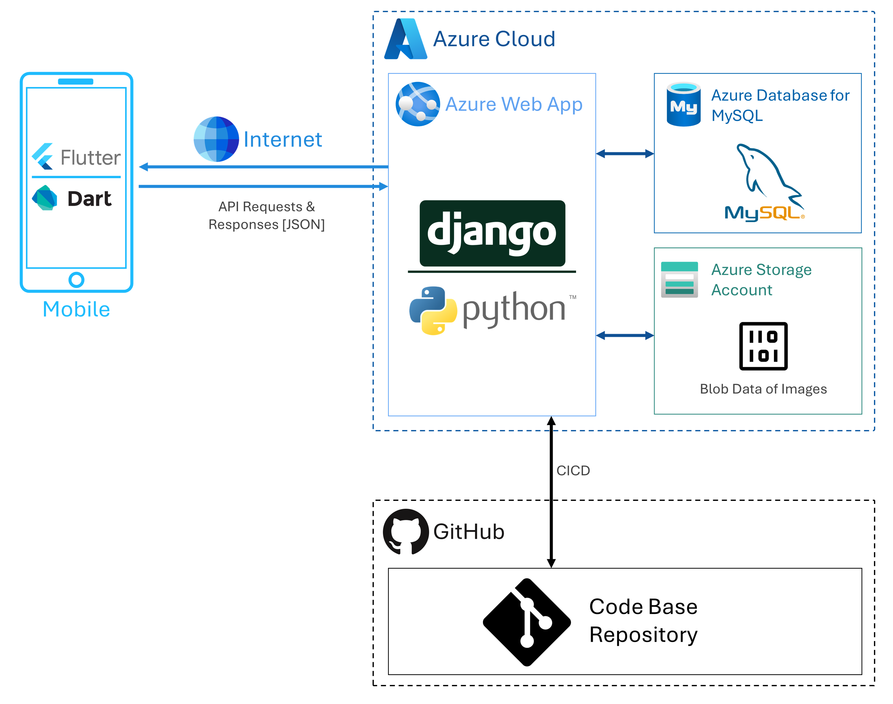
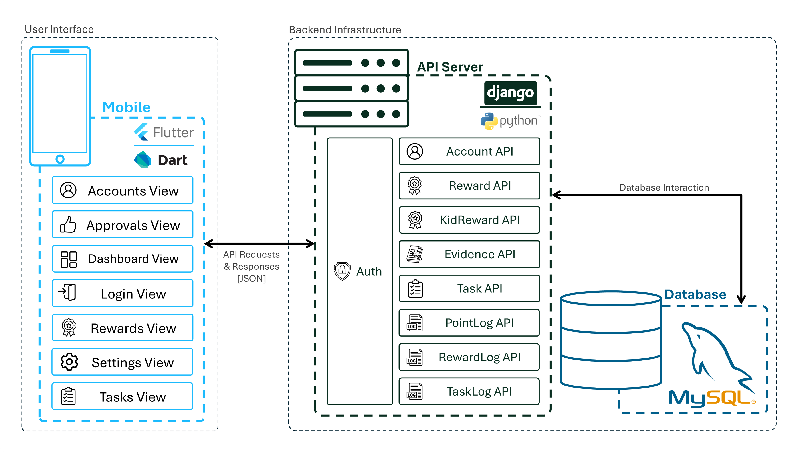
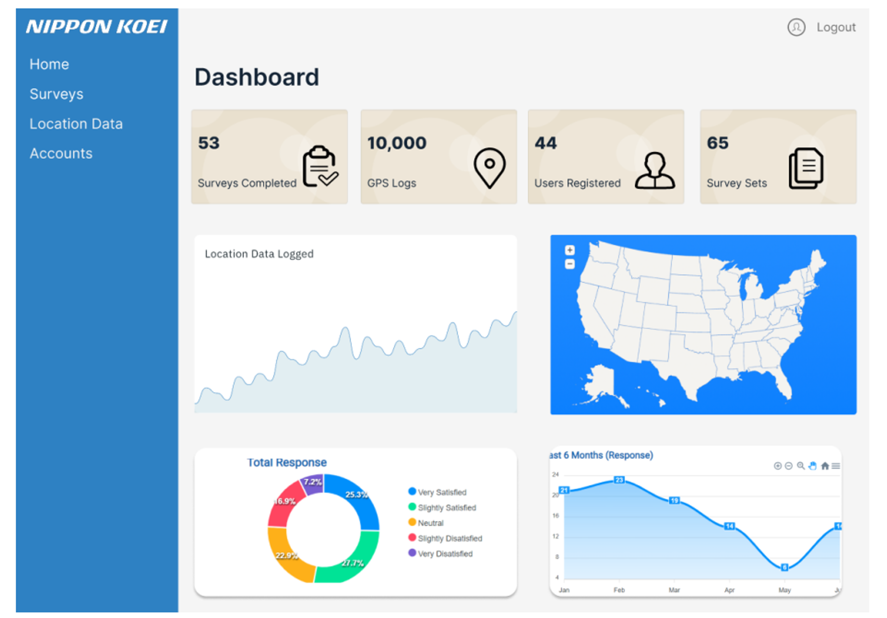
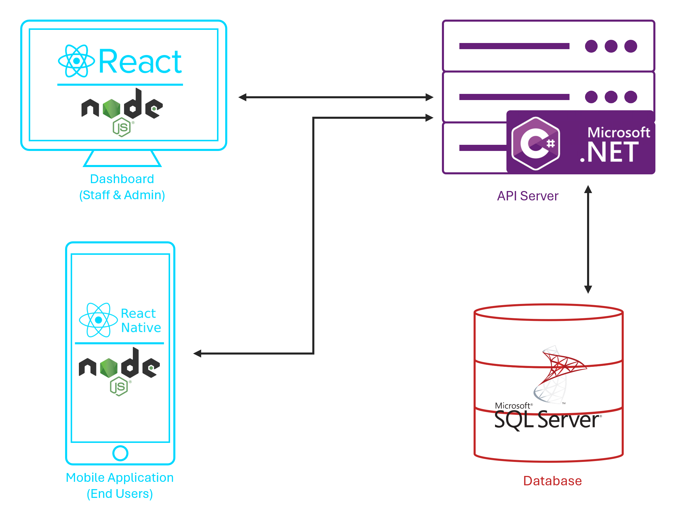
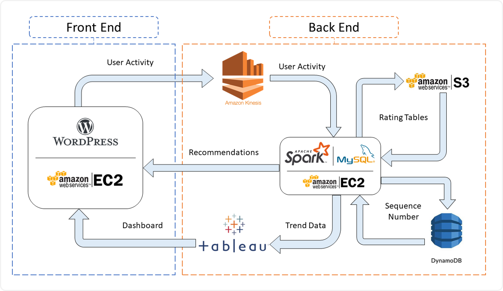

<head>
	<link href="https://cdn.jsdelivr.net/gh/devicons/devicon@v2.15.1/devicon.min.css" rel="stylesheet">
</head>

  

    
  

  

    

		Singapore 
		kdingyuan@gmail.com 
		<a href="https://www.linkedin.com/in/kohdy/" target="_blank">www.linkedin.com/in/kohdy/</a>  
		Downloads: <a href="./assets/files/KohDingYuan_Resume.pdf">PDF Resume</a> | <a href="./assets/files/KohDingYuan_Testimonials.pdf">Testimonials</a>
    

  

---
<strong></strong>

## Profile

	Dynamic <strong>Software Engineer</strong> with over <strong>three years of experience</strong> in <strong>optimizing software performance</strong> and <strong>managing intricate IT projects</strong>. Expertise in <strong>automation tool development</strong> and <strong>data management</strong> facilitates innovative solutions that significantly <strong>enhance operational efficiency</strong>. Proven ability to <strong>streamline workflows</strong> and elevate team collaboration through strong communication and technical skills. Committed to leveraging <strong>analytical capabilities</strong> to <strong>drive impactful software engineering initiatives</strong> and deliver exceptional results.

---

## Professional Experience

	<strong>Senior Software Engineer</strong> | Apr 2025 – Now
	 <em>Capgemini Singapore Pte. Ltd., Singapore</em>  

	

		
Details

		<ul class="text-justify">
			<li>
				Developed <strong>automation tools</strong> using <strong>Java (Jira API)</strong> and <strong>Python</strong>, enabling bulk updates of hundreds of Jira records within minutes, reducing manual effort from several hours to under 10 minutes, improving process efficiency by <strong>over 90%</strong>.
			</li> 
			<li>
				Contributed to a pipeline utilizing <strong>Large Language Models (LLMs)</strong> for <strong>automated test case generation</strong>, accelerating QA workflows and enhancing AI-driven testing capabilities.
			</li> 
			<li>
				Achieved <strong>Tricentis Tosca Consultant Certification</strong>, demonstrating expertise in modern test automation tools.
			</li> 
			<li>
				Collaborated with <strong>cross-functional teams</strong> to align objectives and optimize development processes for timely project delivery.
			</li> 
		</ul>
	

	<strong>Research Assistant</strong> | Oct 2021 – Jan 2023
	 <em>Singapore Institute of Technology, Singapore</em>
	
	

		
Details

		
Conducted <strong>quantitative data</strong> analysis and developed an <strong>Excel-based data capture system</strong>, improving data organization and streamlining team workflows.

		<ul class="text-justify">
			<li>
				<strong>Project Blended Design and Critical Thinking</strong> 
				Supported a <strong>SIT ALIGN-funded research initiative</strong> through <strong>lesson observations</strong> and <strong>literature reviews</strong>, contributing insights that informed project design and critical thinking frameworks.
			</li> 
		</ul>
	

---

## Internships

	<strong>IT Project Management Intern</strong> | Aug 2023 – Apr 2024
	 <em>ASM International N.V., Singapore</em>

	

		
Details

		
Supported the management of multiple <strong>IT projects</strong>, improving project execution efficiency and streamlining administrative workflows.

		<ul class="text-justify">
			<li>
				<strong>Project Panaya</strong> 
				Led the <strong>onboarding and implementation</strong> of Panaya, a <strong>web-based SAP test management and automation solution</strong> replacing the company’s Excel-based tracking system. Developed comprehensive <strong>user documentation</strong> and coordinated with stakeholders to ensure smooth adoption and successful rollout.
			</li> 
			<li>
				<strong>Project Variant Configurator (VC) Phase 2</strong> 
				Assisted in <strong>System Integration Testing (SIT)</strong>, <strong>User Acceptance Testing (UAT)</strong>, and <strong>Go-Live</strong> activities; coordinated onsite efforts to ensure seamless execution.
			</li> 
			<li>
				<strong>Project TRANS4M</strong> 
				Managed <strong>administrative and logistics support</strong>, enhancing coordination and overall project efficiency.
			</li> 
		</ul>
	

	<strong>Software Development Intern</strong> | Apr 2018 – Aug 2018
	 <em>KEYfields Pte. Ltd., Singapore</em>

	

		
Details

		
Conducted research and development using <strong>C#, ASP.NET, and MS SQL</strong>, improving overall application performance and user experience

		<ul class="text-justify">
			<li>
				<strong>Route Optimization Algorithm</strong> 
				Designed and implemented a route optimization algorithm leveraging the <strong>Google Maps API</strong> to solve the <strong>Traveling Salesman Problem</strong>, increasing route-planning efficiency <strong>by over 70%</strong>.
			</li> 
			<li>
				<strong>National Trade Platform (NTP)</strong> 
				Contributed to the National Trade Platform (NTP) project in collaboration with <strong>Singapore Customs</strong> and <strong>Accenture</strong>, developing <strong>API functions</strong> and <strong>data transformation processes</strong> to enhance system integration and streamline trade operations.
			</li> 
			<li>
				<strong>Backup Checker</strong> 
				Built a Backup Checker console tool to monitor backup files and detect anomalies, strengthening <strong>data security and system reliability.</strong>
			</li> 
			<li>
				<strong>Brute Force Attack Detection</strong> 
				Detected and analyzed <strong>SQL Server brute-force attacks</strong>, producing mitigation recommendations that improved <strong>system resilience and security posture.</strong>
			</li> 
		</ul>
	

---

## National Service

	<strong>Store Incharge</strong>| Dec 2019 – Aug 2021
	 <em>Republic of Singapore Air Force, Singapore</em>
	

		
Details

		<ul class="text-justify">
			<li>
				Managed <strong>unit procurement finances</strong> and oversaw <strong>building operations</strong>, improving operational efficiency and fostering effective communication with contractors.
			</li> 
			<li>
				Assisted in <strong>annual budget planning</strong> by analyzing three years of expense data, enhancing financial forecasting and resource allocation.
			</li> 
			<li>
				Supervised <strong>infrastructural improvement projects</strong> and optimized tracking using advanced <strong>Excel tools</strong>, resulting in more efficient project management and stronger vendor relationships.
			</li> 
		</ul>
	

---

## Notable Projects

	<strong>Mobile Application Development for Reward Pedagogy Research | 2024</strong>
	 <em>BSc Computing Science Undergraduate | Singapore Institute of Technology</em>

	

		
View Project Details

		 

		<strong>Client</strong>: Prof. Peter C Y Yau (University of Glasgow)

		

		
Developed a comprehensive full-stack mobile application independently to support reward-based systems in education, aimed at boosting student motivation and engagement.  The solution features dedicated portals for teachers, parents, and students, enabling task and reward management using stars, hearts, and diamonds. Parents can assign tasks and rewards, while children track progress and redeem rewards, fostering an engaging and interactive learning environment.  Built using React Native or Flutter, the app provides a seamless user experience, supported by a robust and scalable backend, showcasing the versatility and technical expertise applied in every aspect of the project.  The project well exceeded the client's expectations during the Minimum Viable Product (MVP) delivery phase, leaving the client highly satisfied with the results. Furthermore, the application is set to serve as a benchmark for future progression of the research which involves multiple universities and institutes globally, highlighting its impactful design and long-term potential.

		

			
View Technical Details

			 

			<h3>Tech Stack</h3>
			<ul>
				<li>
					<strong>Front End (Android Mobile)</strong>: 
					
						<i class="devicon-flutter-plain" style="color: #02569B;"></i>
						Flutter
					
					
						<i class="devicon-dart-plain" style="color: #0175C2;"></i>
						Dart
					
					
						<i class="devicon-materialui-plain" style="color: #0081CB;"></i>
						Material UI
					
					  
				</li>
				<li>
					<strong>Back End (API Server)</strong>: 
					
						<i class="devicon-django-plain" style="color: #092E20;"></i>
						Django
					
					
						<i class="devicon-python-plain" style="color: #3776AB;"></i>
						Python
					
					  
				</li>
				<li>
					<strong>Database</strong>: 
					
						<i class="devicon-mysql-plain" style="color: #4479A1;"></i>
						MySQL
					
					  
				</li>
			</ul>

			<h3>Solution Architecture</h3>

			
			

			 
			
The architecture uses a REST API for clear separation of concerns and modularity, essential for scalable and maintainable application development. The mobile app frontend is created with Flutter, while the backend API server is built using Django. This design enables independent operation of the frontend and backend, making updates and maintenance easier. Django functions solely as an API server handling requests and responses.  This improves the system's effectiveness by offloading data processing and business logic to the backend. The backend server interacts with a MySQL database, serving as the centralized data storage for the application. Using RESTful APIs ensures that communication between the frontend and backend is stateless, standardized, and easily scalable, enabling seamless handling of high loads and multiple client requests.  This architectural design supports flexibility by allowing independent development and scaling of the frontend while maintaining consistent and efficient communication through RESTful APIs.

		

	

	<strong>Activity Survey Application for Smart City Planning | 2022 - 2023</strong>  
	 <em>BSc Computing Science Undergraduate | Singapore Institute of Technology</em>  

	

		
View Project Details

		 

		<strong>Client</strong>: Nippon Koei Co., Ltd.

		
		

		
For this project, I was responsible for the technical leadership of a 10-person team in the development of a cross-platform mobile application intended to simplify the travel survey process, aligned with the requirements specified by our client, Nippon Koei Co., Ltd.  The mobile application was designed to collect GPS and Bluetooth connection logs, facilitating more convenient data sharing by respondents through a web-based questionnaire. By replacing the traditional door-to-door survey method, our solution enables more accurate and efficient data collection.  I also oversaw the integration of a web-based dashboard that allows administrators to manage surveys, accounts, and conduct data analysis. This dashboard interfaces with the mobile application via a Web API and supports cloud-based data storage.  The project's ultimate objective was to streamline the travel survey process, enhance the user experience, and contribute valuable data to support urban redevelopment and transportation improvement initiatives.  Our team emerged as the only group to present a working MVP that met all client requirements, and we further enhanced the solution with added complexity to improve its functionality and practicality. The final product not only met the client's needs but exceeded expectations, providing a robust and scalable solution for future use.

		

			
View Technical Details

			 

			<h3>Tech Stack</h3>
			<ul>
				<li>
					<strong>Front End (Mobile)</strong>: 
					
						<i class="devicon-react-original" style="color: #61DAFB;"></i>
						React Native
					
					
						<i class="devicon-nodejs-plain" style="color: #339933;"></i>
						Node.js
					
					  
				</li>
				<li>
					<strong>Front End (Dashboard)</strong>: 
					
						<i class="devicon-react-original" style="color: #61DAFB;"></i>
						React.js
					
					
						<i class="devicon-nodejs-plain" style="color: #339933;"></i>
						Node.js
					
					  
				</li>
				<li>
					<strong>Back End (API Server)</strong>: 
					
						<i class="devicon-csharp-plain" style="color: #239120;"></i>
						C#
					
					
						<i class="devicon-dotnetcore-plain" style="color: #512BD4;"></i>
						ASP.Net
					
					  
				</li>
				<li>
					<strong>Database</strong>: 
					
						<i class="devicon-microsoftsqlserver-plain" style="color: #CC2927;"></i>
						Microsoft SQL Server (MS SQL)
					
					  
				</li>
			</ul>

			<h3>Solution Architecture</h3>
			
			 
			
The solution architecture integrates a mobile application, a web-based dashboard, and a backend database to streamline the travel survey process. The mobile app enables users to track travel data via GPS, complete dynamically generated surveys, and store local data temporarily for offline access. It also includes features like reward points redemption to incentivize participation.  The web dashboard provides staff with tools for data analysis, survey and account management, and a geographical information display. It serves as the interface between the mobile app and the backend, hosting APIs for seamless data transmission. The backend database, hosted on AWS using Amazon RDS and Microsoft SQL Server, securely stores and organizes collected user data, ensuring administrators can maintain and manage the system effectively.

		

	

	<strong>Streaming Analytics for E-Commerce Website | 2018 - 2019</strong>  
	 <em>Diploma Undergraduate | Singapore Polytechnic</em>  

	

		
View Project Details

		 

		<strong>Client</strong>: Singapore Polytechnic

		

		<h3>Tech Stack</h3>
		<ul>
			<li>
				<strong>Front End</strong>: 
				
					<i class="devicon-wordpress-plain" style="color: #4479A1;"></i>
					Wordpress
				
				  
			</li>
			<li>
				<strong>Back End</strong>: 
				
					<i class="devicon-scala-plain" style="color: #DC322F;"></i>
					Scala
				
				  
			</li>
			<li>
				<strong>Database</strong>: 
				
					<i class="devicon-mysql-plain" style="color: #4479A1;"></i>
					MySQL
				
				  
			</li>
		</ul>

		
Development of a real-time machine learning algorithm tailored for streaming analytics in an e-commerce context. The project focused on capturing live user inputs from the website to train a recommendation model using the Alternating Least Squares (ALS) method. This approach enabled the system to dynamically identify and suggest relevant products to users based on their behavior and preferences.  My primary responsibility was writing the code for the machine learning algorithm, ensuring its efficiency and seamless integration into the live environment.  The solution's proof-of-concept was highly valued, and it will be used as a example for courses at Singapore Polytechnic, demonstrating the practical application of machine learning in real-time analytics.

	

---

## Education

	<strong>BSc (Hons) Computing Science | Oct 2024</strong>
	 Singapore Institute of Technology & University of Glasgow  
	 <em>Specialization in Internet of Things (IOT)</em>
	  <em>Three-year direct honors degree program jointly offered by Singapore Institute of Technology (SIT) and the University of Glasgow (UofG).</em>

	<strong>Diploma in Information Technology | May 2019  </strong>
	 Singapore Polytechnic  
	 <em>Specialization in Solution Development</em>

	

		
View Details

		<strong>Electives</strong>
		<ul>
			<li>Advanced Java Programming</li>
			<li>Data Structures and Algorithm</li>
		</ul>

		<strong>CCA Details</strong> 
		CCA: Special Interest Group (SIG)
		<ul>
			<li>Student Developer - School Website Design & Development | 2018/2019</li>
			<li>Student Facilitator - Special Interest Group (SIG) System Training | 2018/2019</li>
			<li>Org Chairman - Microsoft Application Development Training BootCamp | 2017/2018</li>
			<li>Student Facilitator - Special Interest Group (SIG) Foundation Training | 2017/2018</li>
			<li>Participant - Microsoft Student Partners | 2016/2017</li>
			<li>Participant - National Science Experiement (NSE) | 2016/2017</li>
		</ul>
	

	<strong>Singapore-Cambridge GCE O Level | 2015  </strong>
	 Woodgrove Secondary School

---

## Skills
- **Communication Skills** 
  *Strong written and verbal communication abilities demonstrated through technical documentation, training staff, vendor management, and regular updates to stakeholders.*
    
- **Teamwork & Collaboration** 
  *Worked effectively with cross-functional teams to achieve project goals, contributing to collective efforts in research and development tasks.*
    
- **Adaptability** 
  *Adjusted to different roles and industries, thriving in diverse environments such as software development, project management, and research analysis.*
    
- **Problem-Solving** 
  *Utilized analytical thinking to identify and resolve issues, optimizing existing processes and generating extra value.*
    
- **Time Management & Organization** 
  *Managed multiple projects and deadlines simultaneously, ensuring tasks were completed on time while maintaining high-quality results.*
    
- **Leadership & Initiative** 
  *Took leadership in managing tasks, such as overseeing coding teams and setting up SOPs, demonstrating initiative and responsibility in various roles.*
    
- **Analytical Thinking** 
  *Applied analytical skills to data-driven tasks, such as conducting quantitative research and performing financial analysis, to support informed decision-making.*
    

---

## Technical Skills
- **Solution Development**  
  Android Mobile App Development
  Full Stack (Web & API) Development
  IoT Solution Development & Design 
    
- **Programming Languages** 
  
	Assembly Language
  
  
	<i class="devicon-c-plain" style="color: #00599C;"></i>
	C
  
  
	<i class="devicon-csharp-plain" style="color: #239120;"></i>
	C#
  
  
	<i class="devicon-dart-plain" style="color: #0175C2;"></i>
	Dart
  
  
	<i class="devicon-java-plain" style="color: #007396;"></i>
	Java
  
  
	<i class="devicon-javascript-plain" style="color: #F7DF1E;"></i>
	JavaScript
  
  
	<i class="devicon-kotlin-plain" style="color: #7F52FF;"></i>
	Kotlin
  
  
	<i class="devicon-python-plain" style="color: #3776AB;"></i>
	Python
  
  
	<i class="devicon-scala-plain" style="color: #DC322F;"></i>
	Scala
  
  
	SQL
  
  
	T-SQL
  
    
- **Markup Languages** 
  
	<i class="devicon-css3-plain" style="color: #1572B6;"></i>
	CSS
  
  
	<i class="devicon-html5-plain" style="color: #E34F26;"></i>
	HTML
  
  
	JSON
  
  
	<i class="devicon-markdown-original" style="color: #000;"></i>
	Markdown
  
  
	XML
  
  
	XHTML
  
    
- **Frameworks & Libraries** 
  
	<i class="devicon-dotnetcore-plain" style="color: #512BD4;"></i>
	ASP.NET (MVC, Razor, Core)
  
  
	<i class="devicon-bootstrap-plain" style="color: #7952B3;"></i>
	Bootstrap
  
  
	<i class="devicon-django-plain" style="color: #092E20;"></i>
	Django
  
  
	<i class="devicon-flask-original" style="color: #000;"></i>
	Flask
  
  
	<i class="devicon-flutter-plain" style="color: #02569B;"></i>
	Flutter
  
  
	<i class="devicon-jquery-plain" style="color: #0769AD;"></i>
	jQuery
  
  
	<i class="devicon-materialui-plain" style="color: #0081CB;"></i>
	Material UI
  
  
	<i class="devicon-nodejs-plain" style="color: #339933;"></i>
	Node.js
  
  
	<i class="devicon-react-original" style="color: #61DAFB;"></i>
	React.js
  
  
	<i class="devicon-vuejs-plain" style="color: #42B883;"></i>
	Vue.js
  
  
	<i class="devicon-nextjs-original" style="color: #000;"></i>
	Next.js
  
    
- **Databases** 
  
	<i class="devicon-mongodb-plain" style="color: #47A248;"></i>
	MongoDB
  
  
	<i class="devicon-microsoftsqlserver-plain" style="color: #CC2927;"></i>
	Microsoft SQL Server (MS SQL)
  
  
	<i class="devicon-mysql-plain" style="color: #4479A1;"></i>
	MySQL
  
  
	<i class="devicon-sqlite-plain" style="color: #003B57;"></i>
	SQLite
  
    
- **Cloud Computing** 
  
	<i class="devicon-amazonwebservices-plain-wordmark" style="color: #FF9900;"></i>
	Amazon Web Services (AWS)
  
  
	<i class="devicon-googlecloud-plain" style="color: #4285F4;"></i>
	Google Cloud Platform (GCP)
  
  
	<i class="devicon-azure-plain" style="color: #0078D7;"></i>
	Microsoft Azure
  
    

---

## Languages
English
Chinese (Mandarin)